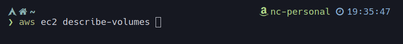

# assume-role-arn
[](https://travis-ci.org/nordcloud/assume-role-arn)

assume-role-arn is a simple golang binary that can be used as an `aws --profile`
alternative or in CI/CD pipelines, so you don't need any external dependencies
while assuming cross-account roles from your environment. No need to install
python/awscli and jq.

### Main features
* no need to setup awscli profiles
* no dependencies, released as binary
* ability to execute in-line commands
* supports external id
* supports source profile in shared credentials files
* made with ❤️ in Nordcloud

## Usage
```
$ eval $(assume-role-arn -r <role_arn>)
$ aws sts get-caller-identity
```
or
```
$ assume-role-arn -r <role_arn> aws sts get-caller-identity
```

Available flags:

*  `-r role_arn` - required, role ARN
*  `-e external_id` - optional, if you need to specify external id
*  `-n role_session_name` - probably you don't need this
*  `-m mfa_serial` - optional, the ARN of MFA virtual device
*  `-mfatoken token` - optional, the MFA token
*  `-profile profile_name` - the name of AWS profile (from $HOME/.aws/config)
*  `-ignoreCache` - ignore the credentials stored in the cache
*  `-skipCache` - skip the credential cache
*  `-envprefix` - add prefix to exported environmental variables (default: "")
*  `-h` - help

## CI/CD pipeline example
Let's say we have three AWS accounts:
* iam
* stg
* prod

You have your IAM deployment user only on `iam` account, but it can assume
cross-account roles in `prod` and `stg` accounts.  Make sure you have your
`AWS_ACCESS_KEY_ID` and `AWS_SECRET_ACCESS_KEY` exported in your pipeline's env
variables.

Go to [Releases](https://github.com/nordcloud/assume-role-arn/releases) and
select binary from the last release you want to use. For v0.2 and linux it would
be
https://github.com/nordcloud/assume-role-arn/releases/download/v0.2/assume-role-arn-linux

Add following steps in the beginning of your deployment script:
```
curl https://github.com/nordcloud/assume-role-arn/releases/download/v0.2/assume-role-arn-linux -o /usr/local/bin/assume-role-arn
chmod +x /usr/local/bin/assume-role-arn

eval $(assume-role-arn -r arn:aws:iam::ACCOUNT_NUMBER_STG:role/Deployment)
```

*Please adjust output path of curl command and role ARN according to your needs.*

Now you should be able to execute AWS-related commands with your assumed role.

## MFA

If your account is secured with MFA (multi-factor authentication) then you have
to provide the ARN of MFA device and the token:
```
eval $(assume-role-arn -r arn:aws:iam:ACCOUNT_NUMBER_STG:role/Role -m arn:aws:iam::ACCOUNT:mfa/MFA_ID -mfatoken MFATOKEN)
```

## AWS Profile

You can put the role name, external id, and the mfa serial device to the profile
in
[`$HOME/.aws/config`](https://docs.aws.amazon.com/cli/latest/userguide/cli-configure-profiles.html)

```ini
[profile Dev]
role_arn = arn:aws:iam::123456789:role/Role
source_profile = dev
region = eu-west-1
mfa_serial = arn:aws:iam::987654321:mfa/john.lenon@world.com
```

with that defined profile, you can run any command that required AWS credentials
(even with MFA) by running
```shell script
assume-role-arn-linux -profile Dev aws s3 ls
```

## powerlevel10k prompt
The binary outputs credentials origins as environment variables:

- AWS_PROFILE_NAME
- AWS_ACCOUNT_ID
- AWS_ROLE_NAME

Which can be used to build custom prompt for p10k.


Put below code in `~/.p10k.zsh` file.

```sh
function prompt_assume_role_arn() {
    if [[ -n $AWS_PROFILE_NAME ]]; then
        local display_text=$AWS_PROFILE_NAME
    elif [[ -n $AWS_ACCOUNT_ID && -n $AWS_ROLE_NAME ]]; then
        local display_text="$AWS_ACCOUNT_ID ($AWS_ROLE_NAME)"
    fi

    [[ -n $display_text ]] || return

    p10k segment -i '' -t $display_text
}
```

Now you can reference your custom promp in config:
```sh
  typeset -g POWERLEVEL9K_RIGHT_PROMPT_ELEMENTS=(
      status
      command_execution_time
      ...
      assume_role_arn
      ...
      time
  )
```

To style it use [powerlevel variables](https://github.com/romkatv/powerlevel10k/blob/master/internal/p10k.zsh#L6741)

Example screenshot



## Authors
* Jakub Woźniak, Nordcloud 🇵🇱
